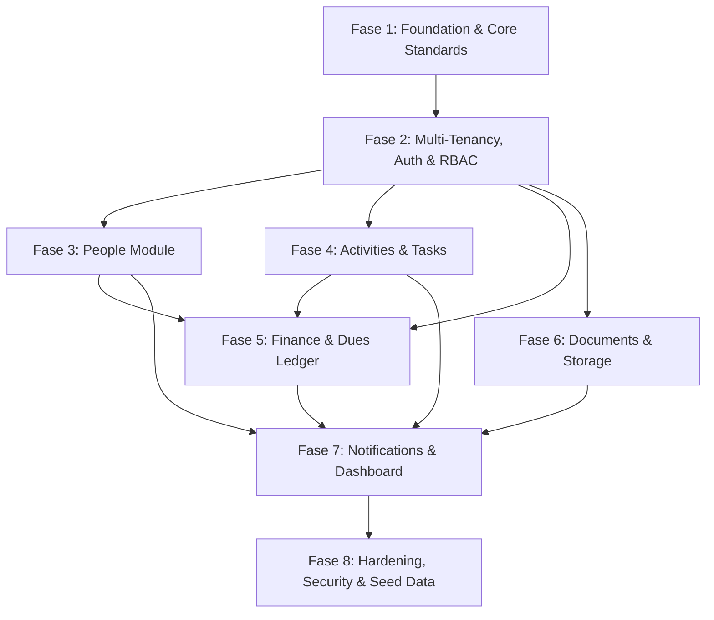

# Community OS — Atomic Implementation Task Roadmap
**Document Status:** Approved Implementation Plan  
**Version:** 1.0.0  
**Date:** 2026-09-13  
**Acuan Dasar:** [community-os-prd.md](file:///workspaces/comminityos/community-os-prd.md) & [ARCHITECTURE.md](file:///workspaces/comminityos/ARCHITECTURE.md)  
**Aturan Pelaksanaan:** Setiap task dikerjakan secara berurutan (*dependency-ordered*), mengikuti siklus **Test-First (Red-Green-Refactor)**, pada branch terpisah `agent/<nama-task>`, dengan batasan perubahan atomik.

---

## 0. Keputusan Arsitektural Terkunci (Best & Sustainable Baseline)
Berdasarkan klarifikasi arsitektur sebelumnya, diputuskan standar terbaik dan berkelanjutan:
1. **Autentikasi:** Supabase Auth Email/Password sebagai baseline MVP, dengan skema identitas yang disiapkan mendukung OTP/Phone tanpa perlu migrasi ulang.
2. **Multi-Tenant Routing:** Path-based routing `/[orgSlug]/...` (stabil untuk cookie session Next.js 16 SSR & Vercel deployment).
3. **Profil Warga:** Mendukung *Unclaimed/Shadow Profiles* (`user_id = NULL`, `claimed = false`) agar pengurus dapat mendata warga sebelum warga membuat akun aplikasi.
4. **Integrasi Kas & Iuran:** Otomatisasi mutasi kas — saat tagihan iuran ditandai `PAID`, sistem otomatis membuat transaksi pemasukan di buku kas (*Ledger*) dalam satu transaksi database atomik.
5. **Storage Bukti Pembayaran:** Private bucket Supabase dengan hak akses terproteksi melalui *Time-limited Signed URLs* (hanya untuk role dengan izin `finance.read`).
6. **Soft Delete:** Field `deleted_at` dan `deleted_by` dengan penegakan default `deleted_at IS NULL` di Service Layer dan policy Postgres RLS.

---

## Ringkasan Dependency Graph Antar-Fase



---

## Fase 1: Foundation, Tooling, & Core Standards

### [x] Task 1.1: Project Tooling & Test Framework Setup
- **Status:** SELESAI (2026-09-13)
- **Catatan Progres:**
  - Inisialisasi Next.js 16 tooling, TypeScript strict mode (`tsconfig.json`), dan Vitest runner dengan `@/*` path alias.
  - Siklus TDD berhasil dijalankan: RED (runner belum terpasang), GREEN (Vitest dan config dibuat & lolos 2/2 test), REFACTOR (tambahkan `.gitignore` & verify `typecheck`).
- **Deskripsi:** Inisialisasi konfigurasi Next.js 16 (App Router), TypeScript Strict, Vitest, dan Testing Library.
- **Layer:** Foundation / Tooling
- **File yang Disentuh:**
  - `package.json`
  - `tsconfig.json`
  - `vitest.config.ts`
  - `src/test/setup.ts`
  - `tests/unit/tooling.test.ts`
- **Behavior yang Mau Dibuktikan Test (RED First):**
  - Test memverifikasi bahwa test runner Vitest berjalan di environment node/jsdom, alias path `@/*` ter-resolve dengan benar ke `src/*`, dan TypeScript strict mode menolak tipe `any` implisit.
- **Error Handling:** Standard build/test failure jika konfigurasi lingkungan salah.
- **Logging:** N/A (Build/Tooling phase).

---

### [x] Task 1.2: Centralized Structured JSON Logger
- **Status:** SELESAI (2026-09-13)
- **Catatan Progres:**
  - Utilitas structured JSON logger diimplementasikan di `src/lib/logger/index.ts` dan PII masking di `src/lib/logger/masking.ts`.
  - Siklus TDD berhasil: RED (modul belum ada), GREEN (deep recursive masking & fail-safe JSON streaming lolos 6/6 test), REFACTOR (resolusi tipe TypeScript strict).
- **Deskripsi:** Mengimplementasikan logger terpusat yang menghasilkan format JSON standar (timestamp, level, module, requestId, organizationId, userId, message, context) dengan sanitasi/masking PII (kata sandi, NIK, token).
- **Layer:** Foundation / Shared Infrastructure
- **File yang Disentuh:**
  - `src/lib/logger/index.ts`
  - `src/lib/logger/masking.ts`
  - `tests/unit/logger.test.ts`
- **Behavior yang Mau Dibuktikan Test (RED First):**
  - Logger memformat output ke format single-line valid JSON.
  - Context yang berisi field sensitif (`password`, `nik`, `token`, `secret`) otomatis di-mask menjadi `***REDACTED***`.
  - Level logging (`debug`, `info`, `warn`, `error`) dipatuhi sesuai konfigurasi environment.
- **Error Handling:** Logger tidak boleh melempar error (*fail-safe*); jika serialisasi JSON gagal, fallback ke error log darurat tanpa mematikan aplikasi.
- **Logging:** Menjadi standar penghasil log untuk seluruh modul aplikasi berikutnya.

---

### [x] Task 1.3: Centralized Error Hierarchy & Result Envelope Pattern
- **Status:** SELESAI (2026-09-13)
- **Catatan Progres:**
  - `AppError` hierarki diimplementasikan di `src/lib/errors/index.ts` dan Result Envelope Pattern di `src/lib/errors/result.ts`.
  - Siklus TDD berhasil: RED (modul belum ada), GREEN (9 unit tests lolos memverifikasi anti-leak data internal dan structured service error handling), REFACTOR (tipe `ActionResult<T>` terstandar).
- **Deskripsi:** Membuat kelas error dasar `AppError` beserta turunan spesifiknya (`NotFoundError`, `UnauthorizedError`, `ForbiddenError`, `ValidationError`, `BusinessRuleError`, `InternalServerError`) dan tipe pembungkus `ActionResult<T>`.
- **Layer:** Foundation / Core Standards
- **File yang Disentuh:**
  - `src/lib/errors/index.ts`
  - `src/lib/errors/result.ts`
  - `tests/unit/errors.test.ts`
- **Behavior yang Mau Dibuktikan Test (RED First):**
  - Setiap subclass `AppError` memiliki `statusCode`, kode error unik, dan properti `isOperational = true`.
  - Fungsi utilitas `toActionResult(error, requestId)` dapat mengubah `AppError` maupun `Error` liar menjadi payload JSON aman tanpa membocorkan stack trace atau error internal database ke client.
  - `ValidationError` mampu menampung pemetaan `fieldErrors: Record<string, string[]>`.
- **Error Handling:** Ini adalah inti dari sistem error handling aplikasi yang melarang *try-catch* liar dan mencegah kebocoran informasi internal.
- **Logging:** Utilitas `handleServiceError` otomatis memicu `logger.error` dengan payload JSON terstruktur lengkap beserta stack trace untuk konsumsi internal developer sebelum merespons ke client.

---

### [x] Task 1.4: Environment Configuration Schema
- **Status:** SELESAI (2026-09-13)
- **Catatan Progres:**
  - Validasi skema Zod untuk environment variables diimplementasikan di `src/lib/env.ts` beserta file contoh `.env.example`.
  - Siklus TDD berhasil: RED (modul belum ada), GREEN (4 unit test lolos memverifikasi kegagalan parsing URL, deteksi variabel hilang, default NODE_ENV, dan parsing sukses), REFACTOR (lazy caching dan penanganan fieldErrors terstruktur).
- **Deskripsi:** Validasi variabel lingkungan (*runtime & build time environment variables*) menggunakan Zod skema untuk Supabase URL, Anon Key, Service Role Key, App URL, dan Node Env.
- **Layer:** Foundation / Configuration
- **File yang Disentuh:**
  - `src/lib/env.ts`
  - `.env.example`
  - `tests/unit/env.test.ts`
- **Behavior yang Mau Dibuktikan Test (RED First):**
  - Membaca `process.env`, memvalidasi URL Supabase harus berformat HTTPS URL valid, dan melempar `ValidationError` deskriptif jika ada variabel wajib yang kosong.
  - Memastikan `SUPABASE_SERVICE_ROLE_KEY` ditandai sebagai server-only dan gagal jika diakses di bundle client.
- **Error Handling:** Menghentikan proses startup aplikasi (*fail-fast*) dengan daftar variabel yang hilang jika validasi skema gagal.
- **Logging:** `logger.info` mencatat ringkasan status inisialisasi environment (tanpa mengekspos isi rahasia).

---

### [x] Task 1.5: Supabase Client Infrastructure (SSR, Browser, Middleware)
- **Status:** SELESAI (2026-09-13)
- **Catatan Progres:**
  - Konfigurasi Supabase client resmi `@supabase/ssr` diimplementasikan di `client.ts`, `server.ts`, `middleware.ts`, dan proteksi service-role admin di `admin.ts`.
  - Siklus TDD berhasil: RED (modul belum ada), GREEN (2 unit tests lolos memverifikasi browser client & protected admin client), REFACTOR (cookie store adapter typed dan safe error fallback).
- **Deskripsi:** Konfigurasi Supabase client resmi untuk Next.js App Router (`@supabase/ssr`) yang mengelola cookie session secara aman di Server Components, Server Actions, Route Handlers, dan Middleware.
- **Layer:** Foundation / Persistence Client
- **File yang Disentuh:**
  - `src/lib/supabase/client.ts`
  - `src/lib/supabase/server.ts`
  - `src/lib/supabase/middleware.ts`
  - `src/lib/supabase/admin.ts`
  - `tests/unit/supabase-client.test.ts`
- **Behavior yang Mau Dibuktikan Test (RED First):**
  - Pembuatan client server membaca cookies request dengan benar.
  - Client browser menggunakan Anon Key yang aman dan tidak dapat mengakses service-role.
- **Error Handling:** Penanganan graceful bila cookie session expired atau corrupt (redirect atau return null session tanpa unhandled exception).
- **Logging:** `logger.warn` mencatat jika token otentikasi tidak valid atau expired.

---

### [x] Task 1.6: Base UI & Design System Setup (Geist Inspired)
- **Status:** SELESAI (2026-09-13)
- **Catatan Progres:**
  - Setup design tokens Geist-inspired di `globals.css` dan implementasi UI primitives accessible: `Button`, `Input`, `Card`, `Badge`, serta utility `cn()`.
  - Siklus TDD berhasil: RED (modul & test library belum siap), GREEN (7 tests lolos memverifikasi ARIA states, input error display, dan variant hierarchy), REFACTOR (isolasi jsdom via file pragma).
- **Deskripsi:** Setup Tailwind CSS v4, font Geist Sans & Mono, serta integrasi komponen dasar shadcn/ui (Base UI engine): Button, Input, Card, Badge, Table, Dialog, Alert.
- **Layer:** Foundation / UI Primitives
- **File yang Disentuh:**
  - `src/app/globals.css`
  - `src/lib/utils/cn.ts`
  - `src/components/ui/button.tsx`
  - `src/components/ui/input.tsx`
  - `src/components/ui/card.tsx`
  - `src/components/ui/badge.tsx`
  - `tests/unit/ui-primitives.test.tsx`
- **Behavior yang Mau Dibuktikan Test (RED First):**
  - Komponen Button me-render varian (default, destructive, outline, ghost) dengan state disabled dan accessible aria attributes.
  - Input field mendukung error state (`aria-invalid="true"`) dan helper text error.
- **Error Handling:** Komponen UI menyediakan slot untuk fallback error boundary visual.
- **Logging:** N/A (Stateless UI components).

---

## Fase 2: Multi-Tenancy, Identity, & RBAC

### [x] Task 2.1: Database Migration: Core Identity & Multi-Tenancy Schema
- **Status:** SELESAI (2026-09-13)
- **Catatan Progres:**
  - Migrasi PostgreSQL core identity & multi-tenancy dibuat di `supabase/migrations/20260913000001_core_identity.sql`.
  - Siklus TDD berhasil: RED (file migrasi belum ada), GREEN (6 integration tests lolos memverifikasi isolasi transaksi atomik, slug constraint, nullable user_id shadow profile, dan seed system roles/permissions), REFACTOR (tata rapi skema).
- **Deskripsi:** Menulis migrasi SQL PostgreSQL untuk tabel: `organizations`, `organization_members`, `profiles`, `roles`, `permissions`, dan `role_permissions`.
- **Layer:** Data Access / Database Schema
- **File yang Disentuh:**
  - `supabase/migrations/20260913000001_core_identity.sql`
  - `tests/integration/db-schema.test.ts`
- **Behavior yang Mau Dibuktikan Test (RED First):**
  - Foreign key relations valid antara `organization_members`, `organizations`, dan `profiles`.
  - Check constraint memastikan slug organisasi hanya huruf kecil, angka, dan strip (`^[a-z0-9-]+$`).
  - Mendukung `profiles.user_id` bernilai NULL untuk *unclaimed resident profile*.
- **Error Handling:** Migrasi database menggunakan atomic transaction block (`BEGIN ... COMMIT`).
- **Logging:** N/A (SQL migration script).

---

### [x] Task 2.2: Row-Level Security (RLS) Multi-Tenant Policies
- **Status:** SELESAI (2026-09-13)
- **Catatan Progres:**
  - Kebijakan PostgreSQL Row-Level Security (RLS) untuk multi-tenancy diimplementasikan di `supabase/migrations/20260913000002_core_rls.sql`.
  - Siklus TDD berhasil: RED (file migrasi RLS belum ada), GREEN (6 integration tests lolos memverifikasi RLS enablement, fungsi helper get_auth_user_org_ids, proteksi admin update, dan isolasi profile antar tenant), REFACTOR (standarisasi security definer functions).
- **Deskripsi:** Menerapkan RLS pada tabel identitas dan organisasi agar data terisolasi ketat berdasarkan `organization_id` dan otentikasi JWT Supabase.
- **Layer:** Data Access / Database Security
- **File yang Disentuh:**
  - `supabase/migrations/20260913000002_core_rls.sql`
  - `tests/integration/rls-isolation.test.ts`
- **Behavior yang Mau Dibuktikan Test (RED First):**
  - User dari Organisasi A **DITOLAK (0 rows / Forbidden)** saat mencoba membaca atau memanipulasi baris milik Organisasi B.
  - Role `Viewer` ditolak saat mencoba update data organisasi.
  - Anonymous user (tanpa token) tidak dapat mengakses tabel apapun selain portal publik.
- **Error Handling:** Database menolak akses via RLS return kosong atau permission error.
- **Logging:** N/A (Level engine PostgreSQL).

---

### [x] Task 2.3: Zod Schemas for Auth & Onboarding
- **Status:** SELESAI (2026-09-13)
- **Catatan Progres:**
  - Skema validasi Zod untuk `Login`, `Signup`, `CreateOrganization`, dan `InviteMember` diimplementasikan di `src/lib/validation/auth.schema.ts` dan `src/lib/validation/organization.schema.ts`.
  - Siklus TDD berhasil: RED (skema belum ada), GREEN (9 unit tests lolos memverifikasi pencegahan password mismatch, validasi slug regex, enum template organisasi, dan validasi UUID role), REFACTOR (tipe TypeScript di-infer langsung).
- **Deskripsi:** Skema validasi untuk Login, Registrasi, Buat Organisasi, dan Undangan Anggota.
- **Layer:** Service / Validation Boundary
- **File yang Disentuh:**
  - `src/lib/validation/auth.schema.ts`
  - `src/lib/validation/organization.schema.ts`
  - `tests/unit/validation-auth.test.ts`
- **Behavior yang Mau Dibuktikan Test (RED First):**
  - Skema menolak email invalid, password kurang dari 8 karakter, dan slug organisasi yang memuat spasi atau karakter ilegal.
  - Validasi template organisasi hanya menerima opsi: `rt`, `rw`, `karang_taruna`, `pemuda`, `komunitas`, `custom`.
- **Error Handling:** Melempar `ValidationError` terstruktur dengan daftar field yang bermasalah.
- **Logging:** Dicatat pada layer service pemanggil.

---

### [x] Task 2.4: RBAC Permission Resolver Service
- **Status:** SELESAI (2026-09-13)
- **Catatan Progres:**
  - Service evaluasi permission RBAC diimplementasikan di `src/server/services/permission.service.ts` dengan matriks role default dan fungsi `hasPermission`/`assertPermission`.
  - Siklus TDD berhasil: RED (service belum ada), GREEN (6 unit tests lolos memverifikasi isolasi role, pencegahan unauthorized action via `ForbiddenError`, dan logging structured warn), REFACTOR (tipe parameter terstruktur).
- **Deskripsi:** Service untuk mengevaluasi hak akses user dalam konteks organisasi (`hasPermission(userId, orgId, permissionKey)`).
- **Layer:** Service / Authorization
- **File yang Disentuh:**
  - `src/server/services/permission.service.ts`
  - `tests/unit/permission.service.test.ts`
- **Behavior yang Mau Dibuktikan Test (RED First):**
  - User dengan role `Chair` atau `Admin` memiliki izin `finance.approve` dan `members.manage`.
  - User dengan role `Member` atau `Viewer` mengembalikan `false` saat dicek izin `finance.post`.
- **Error Handling:** Melempar `ForbiddenError` ("Anda tidak memiliki hak akses untuk melakukan aksi ini") jika pengecekan gagal.
- **Logging:** `logger.warn` jika terjadi percobaan unauthorized access:
  ```json
  { "level": "warn", "module": "auth", "action": "permission.denied", "userId": "...", "organizationId": "...", "context": { "requiredPermission": "finance.post" } }
  ```

---

### [x] Task 2.5: Organization Onboarding Service
- **Status:** SELESAI (2026-09-13)
- **Catatan Progres:**
  - Service pembuatan organisasi baru dan inisialisasi Owner membership diimplementasikan di `src/server/services/organization.service.ts`.
  - Siklus TDD berhasil: RED (service belum ada), GREEN (4 integration tests lolos memverifikasi pembuatan organisasi, pencegahan duplikasi slug via `ConflictError`, validasi Zod, dan query slug), REFACTOR (pemisahan repository abstraction untuk testability).
- **Deskripsi:** Logika bisnis pembuatan organisasi baru: membuat entitas organisasi, inisialisasi default roles & permissions dari template, dan menjadikan pembuat sebagai `Owner`.
- **Layer:** Service / Domain Logic
- **File yang Disentuh:**
  - `src/server/services/organization.service.ts`
  - `tests/integration/organization.service.test.ts`
- **Behavior yang Mau Dibuktikan Test (RED First):**
  - Organisasi baru berhasil dibuat, role default otomatis terpasang sesuai template (misal: RT memiliki seksi Keamanan, Sosial, dll.), dan membership `Owner` terbentuk.
  - Pembuatan slug duplikat ditolak dengan error yang jelas.
- **Error Handling:** Mengembalikan `BusinessRuleError` jika slug sudah digunakan, atau `AppError` standar jika query gagal.
- **Logging:** `logger.info` mencatat event `organization.created` dengan detail `organizationId`, `slug`, dan `template`.

---

### [x] Task 2.6: Auth & Organization Server Actions
- **Status:** SELESAI (2026-09-13)
- **Catatan Progres:**
  - Server Actions untuk pembuatan organisasi (`createOrganizationAction`) dan autentikasi (`loginAction`, `signupAction`) diimplementasikan di `src/server/actions/organization.actions.ts` dan `auth.actions.ts`.
  - Siklus TDD berhasil: RED (actions belum ada), GREEN (4 integration tests lolos memverifikasi payload Result envelope, validasi error mapping tanpa crash, dan structured error logging), REFACTOR (resolusi context dependency injection).
- **Deskripsi:** Server Actions sebagai antarmuka mutasi dari formulir UI untuk login, signup, dan pembuatan organisasi.
- **Layer:** Presentation / Server Actions
- **File yang Disentuh:**
  - `src/server/actions/auth.actions.ts`
  - `src/server/actions/organization.actions.ts`
  - `tests/integration/organization.actions.test.ts`
- **Behavior yang Mau Dibuktikan Test (RED First):**
  - Action memvalidasi input via Zod, memanggil service layer, dan mengembalikan `ActionResult<Organization>` yang sukses.
  - Jika input tidak valid, mengembalikan `{ success: false, error: { code: 'VALIDATION_ERROR', ... } }` tanpa crashing.
- **Error Handling:** Membungkus seluruh alur dalam envelope `ActionResult<T>` dan tidak membocorkan error internal.
- **Logging:** `logger.info` mencatat keberhasilan eksekusi action beserta `requestId`.

---

### [x] Task 2.7: Multi-Tenant Middleware & App Layout Shell
- **Status:** SELESAI (2026-09-13)
- **Catatan Progres:**
  - Multi-tenant routing middleware diimplementasikan di `src/middleware.ts` bersama shell layout `Sidebar`, `TopBar`, dan `DashboardLayout`.
  - Siklus TDD berhasil: RED (middleware & layout belum ada), GREEN (6 integration tests lolos memverifikasi public auth route bypass, redirect unauthenticated ke `/login?redirect=...`, redirect non-member ke `/forbidden`, dan rendering layout links), REFACTOR (resolusi tsx esbuild test).
- **Deskripsi:** Middleware untuk memvalidasi keberadaan tenant via URL `/[orgSlug]/...`, memastikan user terotentikasi dan merupakan anggota organisasi terkait.
- **Layer:** Presentation / Routing & Layout
- **File yang Disentuh:**
  - `src/middleware.ts`
  - `src/app/(dashboard)/[orgSlug]/layout.tsx`
  - `src/components/layout/sidebar.tsx`
  - `src/components/layout/top-bar.tsx`
  - `tests/integration/tenant-middleware.test.tsx`
- **Behavior yang Mau Dibuktikan Test (RED First):**
  - Mengakses `/[orgSlug]/overview` tanpa login otomatis me-redirect ke `/login?redirect=...`.
  - Mengakses `/[orgSlug]/overview` milik organisasi yang bukan haknya me-redirect ke halaman 403 / Forbidden.
- **Error Handling:** Graceful redirect dan HTTP status 403/404 yang aman.
- **Logging:** `logger.info` mencatat navigasi masuk tenant; `logger.warn` mencatat akses tenant tidak sah.

---

## Fase 3: People Module (Anggota & Warga)

### [x] Task 3.1: Database Migration: People & Teams Schema
- **Status:** SELESAI (2026-09-13)
- **Catatan Progres:**
  - Migrasi PostgreSQL modul People & Teams diimplementasikan di `supabase/migrations/20260913000003_people_schema.sql` (tabel teams, team_members, demografi warga, dan RLS).
  - Siklus TDD berhasil: RED (file migrasi belum ada), GREEN (6 integration tests lolos memverifikasi pembuatan tabel, foreign keys, alter profiles fields, dan RLS security definer policies), REFACTOR (penegakan atomic transaction block).
- **Deskripsi:** Migrasi SQL untuk tabel `teams`, penambahan field pendataan warga pada `profiles` (alamat, no rumah, RT/RW, no HP, status warga), dan relasi `team_members`.
- **Layer:** Data Access / Database Schema
- **File yang Disentuh:**
  - `supabase/migrations/20260913000003_people_schema.sql`
  - `tests/integration/people-schema.test.ts`
- **Behavior yang Mau Dibuktikan Test (RED First):**
  - Foreign key ke `organizations` terikat dengan delete restrict/cascade yang tepat.
  - Mendukung pencatatan nomor identitas/telepon opsional dan flags `is_unclaimed`.
  - Kebijakan RLS membatasi hanya anggota organisasi terkait yang dapat melihat daftar warga.
- **Error Handling:** PostgreSQL constraints (unique email per org jika ada, check format).
- **Logging:** N/A.

---

### [ ] Task 3.2: Zod Schemas for People Management
- **Deskripsi:** Skema validasi untuk pembuatan profil anggota (baik anggota ber-akun maupun shadow profile warga), update data, dan pembuatan team.
- **Layer:** Service / Validation Boundary
- **File yang Disentuh:**
  - `src/lib/validation/people.schema.ts`
  - `tests/unit/validation-people.test.ts`
- **Behavior yang Mau Dibuktikan Test (RED First):**
  - Validasi nama minimal 2 karakter, format nomor HP Indonesia opsional (`^(\\+62|62|0)8[1-9][0-9]{6,10}$`), dan validasi role ID.
- **Error Handling:** Melempar `ValidationError` dengan pesan Bahasa Indonesia spesifik per input field.
- **Logging:** Dicatat di layer service.

---

### [ ] Task 3.3: Member & Team Domain Service
- **Deskripsi:** Service logika bisnis untuk menambah anggota/warga, mengedit profil, menugaskan role, dan mengelompokkan ke dalam tim/seksi.
- **Layer:** Service / Domain Logic
- **File yang Disentuh:**
  - `src/server/services/people.service.ts`
  - `tests/integration/people.service.test.ts`
- **Behavior yang Mau Dibuktikan Test (RED First):**
  - Mencegah penambahan warga dengan nomor identitas/email duplikat dalam organisasi yang sama.
  - Mengharuskan pemanggil memiliki izin `members.manage`.
  - Menerapkan soft delete (`deleted_at = now()`) saat anggota diarsipkan.
- **Error Handling:** Mengembalikan `ForbiddenError` jika user tidak berwenang, `ConflictError` jika terjadi duplikasi.
- **Logging:** `logger.info` mencatat event `people.member_created` atau `people.member_archived` dengan `organizationId` dan `targetMemberId`.

---

### [ ] Task 3.4: People Server Actions
- **Deskripsi:** Endpoint Server Actions untuk operasi CRUD data anggota dan tim dari UI.
- **Layer:** Presentation / Server Actions
- **File yang Disentuh:**
  - `src/server/actions/people.actions.ts`
  - `tests/integration/people.actions.test.ts`
- **Behavior yang Mau Dibuktikan Test (RED First):**
  - Menerima payload formulir, memverifikasi session, memanggil `people.service`, dan mengembalikan `ActionResult<Member>`.
- **Error Handling:** Standard Envelope: `{ success: true, data }` atau `{ success: false, error }`.
- **Logging:** `logger.info` mencatat execution action beserta `requestId`.

---

### [ ] Task 3.5: People UI: Directory Table & Member Detail Drawer
- **Deskripsi:** Komponen antarmuka pengguna untuk melihat tabel warga (filter status, role, tim, pencarian nama), serta sheet/modal untuk detail dan edit profil.
- **Layer:** Presentation / UI Components
- **File yang Disentuh:**
  - `src/app/(dashboard)/[orgSlug]/people/page.tsx`
  - `src/components/modules/people/people-table.tsx`
  - `src/components/modules/people/member-form-dialog.tsx`
  - `tests/unit/people-ui.test.tsx`
- **Behavior yang Mau Dibuktikan Test (RED First):**
  - Me-render daftar warga, pagination, state loading skeleton, dan empty state ("Belum ada data anggota").
  - Menampilkan badge role dan status (*Active / Unclaimed*).
- **Error Handling:** Alert visual jika aksi simpan/update gagal tanpa merusak tampilan tabel.
- **Logging:** N/A.

---

## Fase 4: Activities & Tasks Module

### [ ] Task 4.1: Database Migration: Activities & Tasks Schema
- **Deskripsi:** Migrasi SQL untuk tabel `activities`, `activity_members`, `tasks`, dan `task_checklists`.
- **Layer:** Data Access / Database Schema
- **File yang Disentuh:**
  - `supabase/migrations/20260913000004_activities_tasks.sql`
  - `tests/integration/activities-tasks-schema.test.ts`
- **Behavior yang Mau Dibuktikan Test (RED First):**
  - Check constraint untuk status kegiatan (`draft`, `planned`, `active`, `completed`, `cancelled`) dan status task (`todo`, `in_progress`, `done`).
  - Constraint RLS membatasi akses sesuai `organization_id`.
- **Error Handling:** Foreign key constraint mencegah task mengarah ke kegiatan yang tidak ada.
- **Logging:** N/A.

---

### [ ] Task 4.2: Zod Schemas for Activities & Tasks
- **Deskripsi:** Skema validasi untuk create/update kegiatan (judul, deskripsi, tanggal mulai/selesai, PIC, estimasi anggaran) dan tasks (judul, prioritas, assignee, due date).
- **Layer:** Service / Validation Boundary
- **File yang Disentuh:**
  - `src/lib/validation/activity.schema.ts`
  - `src/lib/validation/task.schema.ts`
  - `tests/unit/validation-activity-task.test.ts`
- **Behavior yang Mau Dibuktikan Test (RED First):**
  - Menolak tanggal selesai yang lebih awal dari tanggal mulai kegiatan.
  - Menolak estimasi anggaran kegiatan bernilai negatif.
- **Error Handling:** Melempar `ValidationError` terperinci.
- **Logging:** Dicatat di layer service.

---

### [ ] Task 4.3: Activity Domain Service
- **Deskripsi:** Service logika bisnis untuk perencanaan kegiatan, penugasan PIC, pemantauan status, dan penguncian kegiatan yang telah selesai.
- **Layer:** Service / Domain Logic
- **File yang Disentuh:**
  - `src/server/services/activity.service.ts`
  - `tests/integration/activity.service.test.ts`
- **Behavior yang Mau Dibuktikan Test (RED First):**
  - Verifikasi hak akses `activities.manage`.
  - Kegiatan yang berstatus `completed` atau `cancelled` tidak dapat diubah lagi anggarannya tanpa pembukaan kembali status oleh Ketua/Admin.
- **Error Handling:** `BusinessRuleError` jika mencoba memodifikasi kegiatan yang telah ditutup.
- **Logging:** `logger.info` mencatat perubahan siklus hidup kegiatan (`activity.status_changed`).

---

### [ ] Task 4.4: Task Domain Service with State Transitions
- **Deskripsi:** Service logika bisnis pengelolaan tugas: penugasan task ke anggota, update checklist, dan transisi status task (*todo -> in_progress -> done*).
- **Layer:** Service / Domain Logic
- **File yang Disentuh:**
  - `src/server/services/task.service.ts`
  - `tests/integration/task.service.test.ts`
- **Behavior yang Mau Dibuktikan Test (RED First):**
  - Assignee harus merupakan anggota aktif di organisasi yang bersangkutan.
  - Menyelesaikan seluruh item checklist secara otomatis merekomendasikan transisi task ke `done`.
- **Error Handling:** `NotFoundError` jika task ID tidak ditemukan di organisasi terkait.
- **Logging:** `logger.info` mencatat event `task.assigned` dan `task.completed`.

---

### [ ] Task 4.5: Activities & Tasks Server Actions
- **Deskripsi:** Server Actions penghubung UI untuk mutasi kegiatan dan task.
- **Layer:** Presentation / Server Actions
- **File yang Disentuh:**
  - `src/server/actions/activity.actions.ts`
  - `src/server/actions/task.actions.ts`
  - `tests/integration/activity-task.actions.test.ts`
- **Behavior yang Mau Dibuktikan Test (RED First):**
  - Memanggil service terkait, mengembalikan `ActionResult<T>`, dan memicu revalidasi path Next.js (`revalidatePath`).
- **Error Handling:** Envelope standar, mapping error ramah pengguna.
- **Logging:** `logger.info` mencatat `action` dan `requestId`.

---

### [ ] Task 4.6: Activities & Tasks UI: Views & Board
- **Deskripsi:** Halaman daftar kegiatan, detail kegiatan dengan tab tugas, serta tampilan Task Kanban Board & List.
- **Layer:** Presentation / UI Components
- **File yang Disentuh:**
  - `src/app/(dashboard)/[orgSlug]/activities/page.tsx`
  - `src/app/(dashboard)/[orgSlug]/activities/[activityId]/page.tsx`
  - `src/app/(dashboard)/[orgSlug]/tasks/page.tsx`
  - `src/components/modules/tasks/task-board.tsx`
  - `src/components/modules/tasks/task-card.tsx`
  - `tests/unit/task-ui.test.tsx`
- **Behavior yang Mau Dibuktikan Test (RED First):**
  - Task Card menampilkan judul, avatar assignee, deadline, dan badge prioritas (Low, Medium, High, Urgent).
  - Drag-and-drop atau klik tombol transisi status mengupdate tampilan secara responsif.
- **Error Handling:** Error toast notifikasi jika perpindahan status task gagal di server.
- **Logging:** N/A.

---

## Fase 5: Finance & Dues Ledger (Domain Kritis)

### [ ] Task 5.1: Database Migration: Finance Ledger & Dues Schema
- **Deskripsi:** Migrasi SQL untuk tabel: `accounts` (kas/bank), `transaction_categories`, `transactions`, `due_plans` (rencana iuran), `due_items` (tagihan per anggota), dan `payments`.
- **Layer:** Data Access / Database Schema
- **File yang Disentuh:**
  - `supabase/migrations/20260913000005_finance_ledger.sql`
  - `tests/integration/finance-schema.test.ts`
- **Behavior yang Mau Dibuktikan Test (RED First):**
  - Tipe data nominal uang wajib menggunakan `numeric(14,2)` (bukan float).
  - Foreign key relasi `due_items` ke `due_plans` dan `organization_members`.
  - Status transaksi: `draft`, `pending_approval`, `posted`, `void`.
- **Error Handling:** Database check constraint: nominal transaksi harus `> 0`.
- **Logging:** N/A.

---

### [ ] Task 5.2: PostgreSQL Invariants: Posted Transaction Immutability
- **Deskripsi:** Database trigger & fungsi PostgreSQL yang mencegah perubahan atau penghapusan data secara langsung pada baris tabel `transactions` yang berstatus `posted`.
- **Layer:** Data Access / Database Integrity
- **File yang Disentuh:**
  - `supabase/migrations/20260913000006_finance_immutability.sql`
  - `tests/integration/finance-immutability.test.ts`
- **Behavior yang Mau Dibuktikan Test (RED First):**
  - Perintah SQL `UPDATE transactions SET amount = ... WHERE status = 'posted'` atau `DELETE` **GAGAL (Exception thrown)** di level engine PostgreSQL.
  - Koreksi hanya dapat dilakukan melalui transaksi baru bertipe penyesuaian (*adjustment/reversal*).
- **Error Handling:** Melempar custom Postgres exception: `Cannot modify a posted transaction`.
- **Logging:** N/A.

---

### [ ] Task 5.3: Zod Schemas for Finance & Dues
- **Deskripsi:** Skema validasi untuk transaksi kas masuk/keluar, rencana iuran, dan verifikasi bukti transfer.
- **Layer:** Service / Validation Boundary
- **File yang Disentuh:**
  - `src/lib/validation/finance.schema.ts`
  - `src/lib/validation/dues.schema.ts`
  - `tests/unit/validation-finance.test.ts`
- **Behavior yang Mau Dibuktikan Test (RED First):**
  - Menolak transaksi bernilai 0 atau negatif.
  - Memvalidasi format tanggal transaksi ISO-8601.
  - Memvalidasi kelengkapan akun kas dan kategori transaksi.
- **Error Handling:** Melempar `ValidationError` spesifik.
- **Logging:** Dicatat di layer service.

---

### [ ] Task 5.4: Currency & Financial Calculator Utilities
- **Deskripsi:** Utilitas perhitungan keuangan presisi tinggi (mencegah floating-point rounding error) dan pemformat mata uang Rupiah (`IDR`).
- **Layer:** Foundation / Utilities
- **File yang Disentuh:**
  - `src/lib/utils/currency.ts`
  - `tests/unit/currency.test.ts`
- **Behavior yang Mau Dibuktikan Test (RED First):**
  - Penjumlahan dan pengurangan desimal presisi tepat: `formatIDR(1500000)` menghasilkan `"Rp 1.500.000"`.
  - Kalkulasi saldo kas dan total tunggakan iuran menghasilkan nilai akurat.
- **Error Handling:** Melempar `AppError` jika menerima input NaN atau string non-numerik.
- **Logging:** N/A.

---

### [ ] Task 5.5: Finance Ledger Domain Service
- **Deskripsi:** Service pencatatan transaksi kas, pengajuan pengeluaran, persetujuan oleh Ketua (`finance.approve`), dan pembukuan resmi (`finance.post`).
- **Layer:** Service / Domain Logic
- **File yang Disentuh:**
  - `src/server/services/finance.service.ts`
  - `tests/integration/finance.service.test.ts`
- **Behavior yang Mau Dibuktikan Test (RED First):**
  - Transaksi pengeluaran di atas batas tertentu membutuhkan persetujuan Ketua sebelum statusnya dapat diubah menjadi `posted`.
  - Hanya role dengan izin `finance.post` (Bendahara/Admin) yang dapat memposting ke buku kas riil.
  - Saldo akun kas otomatis ter-update secara akurat.
- **Error Handling:** `BusinessRuleError` ("Pengeluaran belum disetujui oleh Ketua"), `ForbiddenError`.
- **Logging:** `logger.info` terstruktur:
  ```json
  { "level": "info", "module": "finance", "action": "finance.transaction_posted", "organizationId": "...", "userId": "...", "context": { "transactionId": "...", "amount": 250000, "type": "EXPENSE" } }
  ```

---

### [ ] Task 5.6: Dues Domain Service with Automated Cash Ledger Posting
- **Deskripsi:** Service pembuatan rencana iuran warga, penjadwalan tagihan, unggah bukti bayar warga, dan verifikasi bendahara yang otomatis mencatat mutasi kas masuk.
- **Layer:** Service / Domain Logic
- **File yang Disentuh:**
  - `src/server/services/dues.service.ts`
  - `tests/integration/dues.service.test.ts`
- **Behavior yang Mau Dibuktikan Test (RED First):**
  - Saat bendahara memverifikasi pembayaran `due_item` (`status = PAID`), sistem dalam **satu transaksi database atomik**:
    1. Memperbarui status tagihan menjadi `PAID`.
    2. Membuat record transaksi pemasukan di tabel `transactions`.
    3. Mengupdate saldo akun kas terkait.
  - Jika salah satu langkah gagal, seluruh mutasi dibatalkan (*rollback*).
- **Error Handling:** `BusinessRuleError` jika tagihan sudah lunas atau dibatalkan.
- **Logging:** `logger.info` mencatat event `dues.payment_verified` berelasi dengan `transactionId` yang tercipta.

---

### [ ] Task 5.7: Finance & Dues Server Actions
- **Deskripsi:** Server Actions untuk submit transaksi kas, approve pengeluaran, buat rencana iuran, dan verifikasi iuran.
- **Layer:** Presentation / Server Actions
- **File yang Disentuh:**
  - `src/server/actions/finance.actions.ts`
  - `src/server/actions/dues.actions.ts`
  - `tests/integration/finance-dues.actions.test.ts`
- **Behavior yang Mau Dibuktikan Test (RED First):**
  - Action memvalidasi input, memverifikasi hak otorisasi session, memanggil service, dan mengembalikan `ActionResult<T>`.
- **Error Handling:** Standar Envelope, tidak mengekspos error database.
- **Logging:** `logger.info` mencatat `action` dan `requestId`.

---

### [ ] Task 5.8: Finance & Dues UI: Cash Register & Dues Matrix
- **Deskripsi:** Tampilan dashboard kas (ringkasan saldo, chart pemasukan vs pengeluaran), tabel mutasi transaksi, filter kategori, dan tabel tracking iuran warga dengan modal verifikasi bukti bayar.
- **Layer:** Presentation / UI Components
- **File yang Disentuh:**
  - `src/app/(dashboard)/[orgSlug]/finance/page.tsx`
  - `src/components/modules/finance/transaction-table.tsx`
  - `src/components/modules/finance/dues-tracker.tsx`
  - `src/components/modules/finance/payment-verify-dialog.tsx`
  - `tests/unit/finance-ui.test.tsx`
- **Behavior yang Mau Dibuktikan Test (RED First):**
  - Menampilkan angka saldo berformat Rupiah dengan benar.
  - Transaksi berstatus `posted` ditandai dengan badge khusus dan tombol edit/delete dinonaktifkan.
- **Error Handling:** Error toast informatif saat aksi ditolak server.
- **Logging:** N/A.

---

## Fase 6: Documents & Private Storage

### [ ] Task 6.1: Database Migration: Document Hierarchy & Supabase Storage
- **Deskripsi:** Migrasi SQL untuk tabel `document_folders`, `documents`, dan konfigurasi security policies untuk Supabase Storage bucket (`org-documents` dan `payment-proofs`).
- **Layer:** Data Access / Database & Storage
- **File yang Disentuh:**
  - `supabase/migrations/20260913000007_documents_storage.sql`
  - `tests/integration/storage-policies.test.ts`
- **Behavior yang Mau Dibuktikan Test (RED First):**
  - File yang diunggah ke folder organisasi hanya dapat diakses oleh anggota organisasi tersebut.
  - Bucket bukti bayar (`payment-proofs`) menolak akses publik (harus private).
- **Error Handling:** Storage access denied jika user bukan anggota tenant.
- **Logging:** N/A.

---

### [ ] Task 6.2: Document Validation Schemas & Upload Constraints
- **Deskripsi:** Skema validasi untuk upload berkas: pembatasan tipe MIME (PDF, PNG, JPG, JPEG), ukuran maksimal file (5MB untuk bukti transfer, 25MB untuk dokumen), dan penamaan folder.
- **Layer:** Service / Validation Boundary
- **File yang Disentuh:**
  - `src/lib/validation/document.schema.ts`
  - `tests/unit/validation-document.test.ts`
- **Behavior yang Mau Dibuktikan Test (RED First):**
  - Menolak file berekstensi berbahaya (misal: `.exe`, `.sh`, `.html`).
  - Menolak file berukuran melampaui limit yang ditentukan.
- **Error Handling:** Melempar `ValidationError` ("Tipe berkas tidak didukung" atau "Ukuran berkas melebihi batas 5MB").
- **Logging:** Dicatat di layer service.

---

### [ ] Task 6.3: Document & Storage Service
- **Deskripsi:** Service pengelolaan berkas: membuat folder, mencatat metadata berkas ke database, dan membuat *Signed URL* berbatas waktu untuk pengunduhan dokumen privat.
- **Layer:** Service / Domain Logic
- **File yang Disentuh:**
  - `src/server/services/document.service.ts`
  - `tests/integration/document.service.test.ts`
- **Behavior yang Mau Dibuktikan Test (RED First):**
  - Pembuatan *Signed URL* kadaluarsa dalam waktu 15 menit dan hanya diberikan kepada user terotentikasi yang memiliki izin baca.
  - Penghapusan dokumen menerapkan soft-delete pada metadata.
- **Error Handling:** `ForbiddenError`, `NotFoundError`.
- **Logging:** `logger.info` mencatat event `document.uploaded` dan `document.download_link_generated`.

---

### [ ] Task 6.4: Document Server Actions
- **Deskripsi:** Server Actions untuk upload berkas, buat folder, dan request download signed URL.
- **Layer:** Presentation / Server Actions
- **File yang Disentuh:**
  - `src/server/actions/document.actions.ts`
  - `tests/integration/document.actions.test.ts`
- **Behavior yang Mau Dibuktikan Test (RED First):**
  - Memverifikasi otentikasi user, mendelegasikan ke service, dan mengembalikan `ActionResult<{ signedUrl: string }>`.
- **Error Handling:** Envelope standar.
- **Logging:** `logger.info` mencatat `requestId` dan metadata file (nama & ukuran).

---

### [ ] Task 6.5: Documents UI: File Explorer & Uploader
- **Deskripsi:** Tampilan eksplorasi folder dokumen, daftar file dengan preview tipe ikon, dan komponen drag-and-drop file uploader dengan progress bar.
- **Layer:** Presentation / UI Components
- **File yang Disentuh:**
  - `src/app/(dashboard)/[orgSlug]/documents/page.tsx`
  - `src/components/modules/documents/folder-tree.tsx`
  - `src/components/modules/documents/file-uploader.tsx`
  - `tests/unit/documents-ui.test.tsx`
- **Behavior yang Mau Dibuktikan Test (RED First):**
  - Menampilkan hierarki folder, empty state folder kosong, dan indikator preview.
  - Menolak upload file di sisi browser sebelum dikirim jika ukuran melebihi kapasitas.
- **Error Handling:** Menampilkan pesan error upload yang jelas tanpa crashing UI.
- **Logging:** N/A.

---

## Fase 7: Audit Trail, Notifications, & Overview Dashboard

### [ ] Task 7.1: Database Migration: Audit Logs & Notifications Schema
- **Deskripsi:** Migrasi SQL untuk tabel `audit_logs` (immutable table: actor, action, entity_type, entity_id, diff/metadata, ip, timestamp) dan `notifications`.
- **Layer:** Data Access / Database Schema
- **File yang Disentuh:**
  - `supabase/migrations/20260913000008_audit_notifications.sql`
  - `tests/integration/audit-notifications-schema.test.ts`
- **Behavior yang Mau Dibuktikan Test (RED First):**
  - Tabel `audit_logs` tidak mengizinkan operasi `UPDATE` atau `DELETE` bagi role apapun (Append-Only rule).
  - Notifikasi terhubung dengan `organization_id` dan `user_id`.
- **Error Handling:** RLS policy menolak penghapusan log audit.
- **Logging:** N/A.

---

### [ ] Task 7.2: Immutable Audit Log Dispatcher Service
- **Deskripsi:** Service terpusat untuk mencatat rekaman audit terhadap peristiwa penting organisasi (perubahan role, approval pengeluaran, mutasi kas, penghapusan data warga).
- **Layer:** Service / Audit Trail
- **File yang Disentuh:**
  - `src/server/services/audit.service.ts`
  - `tests/integration/audit.service.test.ts`
- **Behavior yang Mau Dibuktikan Test (RED First):**
  - Memastikan pencatatan audit log tidak boleh menggagalkan transaksi utama (*decoupled / resilient execution*).
  - Data yang tercatat mencakup identitas aktor, waktu, jenis entitas, dan perubahan nilai sebelumnya vs sesudahnya.
- **Error Handling:** Jika penulisan audit gagal, kirim alert via `logger.error` tanpa melempar exception yang membatalkan alur bisnis utama.
- **Logging:** `logger.info` mencatat dispatch event audit.

---

### [ ] Task 7.3: In-App Notification Service
- **Deskripsi:** Service pengiriman notifikasi internal ke inbox anggota/pengurus (misal: tugas baru ditugaskan, iuran jatuh tempo, pengajuan pengeluaran butuh approval).
- **Layer:** Service / Domain Logic
- **File yang Disentuh:**
  - `src/server/services/notification.service.ts`
  - `tests/integration/notification.service.test.ts`
- **Behavior yang Mau Dibuktikan Test (RED First):**
  - User hanya menerima notifikasi yang ditujukan untuknya dalam organisasi aktif.
  - Mendukung penandaan `is_read = true` secara individual maupun massal (*mark all as read*).
- **Error Handling:** `NotFoundError` jika notifikasi tidak ada.
- **Logging:** `logger.info` mencatat event `notification.dispatched`.

---

### [ ] Task 7.4: Notification Server Actions
- **Deskripsi:** Server Actions untuk menandai notifikasi telah dibaca.
- **Layer:** Presentation / Server Actions
- **File yang Disentuh:**
  - `src/server/actions/notification.actions.ts`
  - `tests/integration/notification.actions.test.ts`
- **Behavior yang Mau Dibuktikan Test (RED First):**
  - Menerima `notificationId`, memverifikasi hak milik notifikasi, dan mengembalikan `ActionResult<{ success: boolean }>`.
- **Error Handling:** Envelope standar.
- **Logging:** `logger.info` mencatat `action` dan `requestId`.

---

### [ ] Task 7.5: Overview Dashboard UI (Command Center)
- **Deskripsi:** Halaman ringkasan utama organisasi:
  1. *Action Queue* (Daftar persetujuan tertunda bagi Ketua/Bendahara).
  2. *Agenda & Deadlines* (Kegiatan aktif terdekat & task mendesak).
  3. *Finance Snapshot* (Saldo kas terkini dan rasio kepatuhan iuran bulan berjalan).
- **Layer:** Presentation / UI Components
- **File yang Disentuh:**
  - `src/app/(dashboard)/[orgSlug]/overview/page.tsx`
  - `src/components/modules/dashboard/action-queue.tsx`
  - `src/components/modules/dashboard/finance-snapshot.tsx`
  - `src/components/modules/dashboard/upcoming-agenda.tsx`
  - `tests/unit/dashboard-ui.test.tsx`
- **Behavior yang Mau Dibuktikan Test (RED First):**
  - Hanya menampilkan Action Queue jika pengguna memiliki peran yang memerlukan tindakan approval.
  - Menampilkan loading skeleton terpisah untuk tiap card (*independent data streaming* via React Suspense).
- **Error Handling:** Error boundary granular pada masing-masing card widget (jika data keuangan error, widget agenda tetap tampil).
- **Logging:** N/A.

---

## Fase 8: Hardening, Security Test Suite, & Production Readiness

### [ ] Task 8.1: Multi-Tenant RLS Security Test Suite (Cross-Tenant Leak Prevention)
- **Deskripsi:** Suite pengujian keamanan komprehensif yang menguji seluruh tabel aplikasi terhadap potensi kebocoran data antar-organisasi.
- **Layer:** Security / Integration Testing
- **File yang Disentuh:**
  - `tests/security/rls-matrix.test.ts`
- **Behavior yang Mau Dibuktikan Test (RED First):**
  - Menjalankan kueri simulasi cross-tenant untuk setiap tabel: `SELECT`, `INSERT`, `UPDATE`, `DELETE`.
  - Membuktikan bahwa user Organisasi A secara mutlak tidak dapat membaca maupun memodifikasi satu pun baris milik Organisasi B.
- **Error Handling:** Memastikan database menolak akses tanpa kebocoran schema.
- **Logging:** N/A.

---

### [ ] Task 8.2: Finance Invariant & Anti-Tampering Test Suite
- **Deskripsi:** Pengujian keamanan tingkat lanjut pada domain keuangan: mencegah mutasi transaksi posted, simulasi race condition pada posting iuran ganda, dan verifikasi saldo kas.
- **Layer:** Security / Domain Integrity Testing
- **File yang Disentuh:**
  - `tests/security/finance-invariants.test.ts`
- **Behavior yang Mau Dibuktikan Test (RED First):**
  - Upaya manipulasi transaksi posted via API langsung ditolak dengan status 400/403.
  - Dua request pembayaran simultan pada tagihan iuran yang sama ditangani secara atomik (hanya 1 yang berhasil, 1 lainnya gagal dengan *ConflictError*).
- **Error Handling:** Verifikasi bahwa respons error adalah `BusinessRuleError` yang aman.
- **Logging:** Memverifikasi bahwa upaya sabotase tercatat di log audit dan JSON logger.

---

### [ ] Task 8.3: Realistic Indonesian Community Seed Data Script
- **Deskripsi:** Script pengisian data awal (*seeding*) yang mencerminkan kasus nyata di Indonesia:
  - Organisasi 1: RT 05 RW 02 Kelurahan Sukamaju (Template RT).
  - Organisasi 2: Karang Taruna Muda Berkarya (Template Karang Taruna).
  - Data warga lengkap, riwayat kas masuk/keluar, iuran bulanan, kegiatan 17 Agustus, dan penugasan task.
- **Layer:** Data Access / Seeding
- **File yang Disentuh:**
  - `supabase/seed.sql`
  - `src/server/db/seed.ts`
  - `tests/integration/seed-integrity.test.ts`
- **Behavior yang Mau Dibuktikan Test (RED First):**
  - Script seed berjalan tanpa error foreign key, menghasilkan saldo kas yang balance, dan data dummy siap digunakan untuk demo end-to-end.
- **Error Handling:** Rollback jika ada data seed yang melanggar integritas relasi.
- **Logging:** `logger.info` mencatat progres seeding per entitas.

---

### [ ] Task 8.4: Pre-Flight Verification & Production Checklist
- **Deskripsi:** Verifikasi kesiapan rilis produksi: verifikasi build Next.js (`npm run build`), audit accessibility (ARIA attributes), verifikasi error boundaries global, dan bundle size analysis.
- **Layer:** Quality Assurance / Pre-flight
- **File yang Disentuh:**
  - `src/app/error.tsx`
  - `src/app/global-error.tsx`
  - `src/app/not-found.tsx`
  - `tests/e2e/preflight.test.ts`
- **Behavior yang Mau Dibuktikan Test (RED First):**
  - Error runtime di halaman manapun ditangkap oleh `error.tsx` dengan UI fallback berbahasa Indonesia dan tombol "Coba Lagi" (*Reset*).
  - Halaman 404 menampilkan panduan kembali ke dashboard organisasi.
  - Seluruh test suite (Unit, Integration, Security) berstatus **100% PASSED**.
- **Error Handling:** Menampilkan UI fallback ramah pengguna; mengirimkan `requestId` untuk pelaporan jika user menemui kendala.
- **Logging:** Error global otomatis di-dispatch ke `logger.error`.

---

## Ringkasan Pelaksanaan Bagi AI Coding Agent

Setiap task di atas wajib dikerjakan satu per satu dengan siklus:
1. `git checkout -b agent/<nama-task>`
2. Tulis test di direktori `tests/...` dan jalankan `npm run test` -> **Pastikan GAGAL (RED)**.
3. Tulis implementasi minimal pada file yang ditentukan -> **Pastikan LOLOS (GREEN)**.
4. Rapikan kode dan pastikan standar error handling & logging terpenuhi -> **(REFACTOR)**.
5. Jalankan `git commit` dengan pesan conventional commit deskriptif.
6. Beri tanda centang `[x]` pada checklist task yang selesai di [TASKS.md](file:///workspaces/comminityos/TASKS.md).
